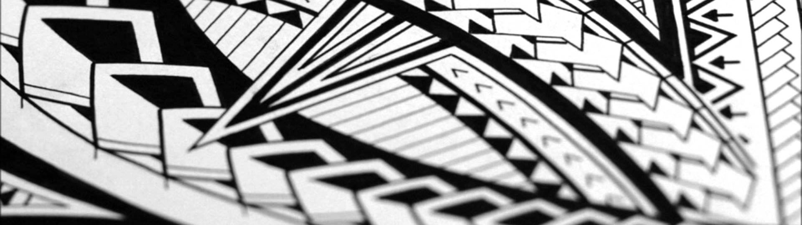

Talofa lava, malo soifua, ma le lagi mama aiga uma o Moananu! Greetings to all our Moananu family! This is a designated gathering place for family and a resource for connecting to our past.

## Reunions
The Stone Family is a direct descendant of [Eneleata Moananu](https://www.familysearch.org/tree/person/details/KW6H-HFB) and is actively hosting family reunions. Come join us at our next event! Here are some important links:

[moananu.com/slack](http://moananu.com/slack)  
[moananu.com/donate](http://moananu.com/donate)  

## Roots
Come find your place in the family tree and let our roots run together. A "gafa" (ngah-fah) is a tree branch which symbolizes family history, origin, and ancestry. To "fai lou gafa" is to literally research your family geneology.

1. Create a free account at [familysearch.org](https://www.familysearch.org/)
2. Contribute your family pedigree
3. Link to a [common ancestor](https://www.familysearch.org/tree/person/details/KW6H-HFB) of Moananu
4. Share family stories

## Royalty
The following gafa demonstrates how the Moananu family fits in with the cheifly [Malietoa](https://en.wikipedia.org/wiki/Malietoa) line.

```
26. Usu Malietoa 'Ae'o'ainu'u  
  (I. usuga) ia Tutumanu 'o le afafine o Uligia I Faleata tasi 'o Seiuli Sa'o'aumaga  
  (II. usuga) toe usu ia Lealaimanoa 'o le afafine 'o Leoi I Sasina tasi 'o Maugatu  
  (III. usuga) toe usu ia Maua'i o le afafine o Laufiso I Safotulafai tasi 'o Moananu ma Taulapapa  
  (IV. usuga) toe usu ia Maua'i 'o le afafine o Laufiso I Safotulafai tasi 'o Moananu ma Taulapapa  
  
  The Marriage(s) of Malietoa 'Ae'o'ainu'u  
  (1st Marriage) He was married to Tutumanu who was the daughter of Uligia of Faleata who was the son of Seiuli Sa'o'aumaga  
  (2nd Marriage) He was married to Lealaimanoa who was the daughter of Leoi of Sasina who was the son of Maugatu  
  (3rd Marriage) He was married to Maua'i who was the daughter of Laufiso of Safotulafai who was the son of Moananu and Taulapapa  
  (4th Marriage) He was married to Maua'i who was the daughter of Laufiso of Safotulafai who was the son of Moananu and Taulapapa

27. Usu Malietoa Laulauafolasa ia Ali'itasi 'o le afafine o Mata'utia I Gautavai tasi 'o Ti'a ma Taulapapa

  Malietoa Laulauafolasa married Ali'itasi who was the daughter of Mata'utia of Gautavai who was the son of Ti'a and Taulapapa

```
[more...](malietoa-uitualagi.md)

## Reach Out
We have a private slack server at [https://moananu.slack.com/](https://moananu.slack.com/) for everyone to communicate. Just ask to receive an invitation.

If you have any problems contact [@ShaneGramlich](https://twitter.com/ShaneGramlich) on twitter.