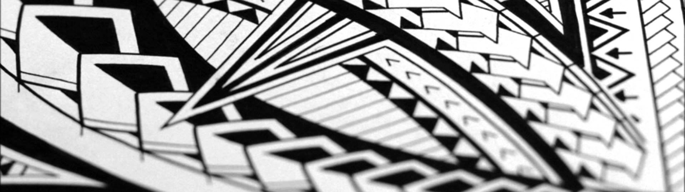

Talofa lava, malo soifua, ma le lagi mama aiga uma o Moananu! Greetings to all our Moananu family! This is a designated gathering place for family and a resource for connecting to our past.

## Roots
Come find your place in the family tree and let our roots run together. A "gafa" (ngah-fah) is a tree branch and symbolizes family history, origin, and ancestry. To "fai lou gafa" is to literally research your family geneology.

1. Create a free account at [familysearch.org](https://www.familysearch.org/)
2. Contribute your family pedigree
3. Link to a common ancestor of Moananu
4. Share family stories

## Rich Heritage
The following gafa demonstrates how the Moananu family fits in with the cheifly [Malietoa](https://en.wikipedia.org/wiki/Malietoa) line.

```
1. O se tas i o...

2. O se tas i o...
```
[more...](malietoa-laupepa.md)

### Reach Out
We have a private slack server at [https://moananu.slack.com/](https://moananu.slack.com/) for everyone to communicate on. Just ask to receive an invitation.

If you have any problems contact [@ShaneGramlich](https://twitter.com/ShaneGramlich) on twitter. 

## Reunions
The Stone Family is a direct descendant of Eneleata Moananu and is actively hosting family reunions. Come join us at our next event! Here are some important links:

[moananu.com/slack](http://moananu.com/slack)  
[moananu.com/donate](http://moananu.com/donate)  